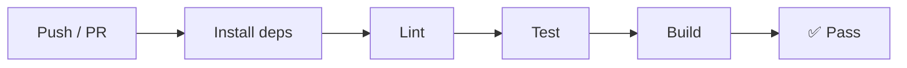

<div align="center">

# Pocket Khata 💰

**পকেট খাতা** — A neo-morphic personal finance manager built with React + Vite

[](https://github.com/sukhendu11/pocket-khata/releases)
[](https://github.com/sukhendu11/pocket-khata/actions)
[](https://opensource.org/licenses/MIT)
[](CONTRIBUTING.md)
[](https://github.com/sukhendu11/pocket-khata/commits/master)
[](https://github.com/sukhendu11/pocket-khata/actions)

Track expenses, manage multiple accounts, set budgets, and stay on top of your finances with bill reminders. **All data stays on your device.**

</div>

---

## 📋 Table of Contents

- [Features](#features)
- [Data Safety & Offline First](#data-safety--offline-first)
- [Security & Privacy](#security--privacy)
- [Backup System](#backup-system)
- [Data Versioning & Safety](#data-versioning--safety)
- [Mobile / PWA Readiness](#mobile--pwa-readiness)
- [Tech Stack](#tech-stack)
- [Project Structure](#project-structure)
- [Architecture](#architecture)
- [Getting Started](#getting-started)
- [Scripts](#scripts)
- [CI / CD](#ci--cd)
- [Troubleshooting](#-troubleshooting)
- [FAQ](#-faq)
- [Version](#version)
- [License](#license)

---

## ✨ Features

### 💳 Core Financial Tracking

| Feature | Description |
|---------|-------------|
| **Dashboard** | Overview of net worth, monthly income/expense, account balances, recent transactions, and spending trends |
| **Transaction Management** | Add, edit, and delete income, expense, and transfer entries with full categorization |
| **Account Management** | Manage Bank, Cash, bKash, Nagad, and custom wallet accounts with real-time balance tracking |
| **Category Manager** | 17 pre-configured default categories with subcategories; create custom categories with icon & color picker |

### 📊 Planning & Analytics

| Feature | Description |
|---------|-------------|
| **Budget Planner** | Set monthly spending limits per category, track usage with visual progress bars |
| **Savings Goals** | Define savings targets, track progress, and contribute from any account |
| **Bill Reminders** | Set recurring or one-time bill reminders with due-date tracking and quick-pay integration |
| **Analytics** | Interactive pie charts and period-based breakdowns of income vs. expense |
| **Calendar View** | See all transactions and reminders plotted on a monthly calendar |

### 💾 Backup & Data Portability

| Feature | Description |
|---------|-------------|
| **JSON Export / Import** | Full database export (accounts, categories, transactions, reminders, budgets, savings goals) as a JSON file for safe backup and restore |
| **Auto-Backups** | Automatic snapshots created before every write operation; up to 3 recent snapshots retained for quick recovery |
| **CSV Export** | Export transactions to CSV for spreadsheet analysis |
| **PDF Reports** | Generate downloadable PDF reports of income vs. expense for any period |

### 🎨 User Experience

| Feature | Description |
|---------|-------------|
| **Dual Language** | Full English and বাংলা (Bangla) support via built-in i18n |
| **Dark Mode** | Toggle between light and dark themes |
| **Neo-morphic UI** | Premium soft-shadow design with smooth animations and micro-interactions |
| **Responsive Layout** | Optimized for mobile with a smartphone-shell viewport; installable as a PWA |
| **Code-Splitting** | Lazy-loaded screens for fast initial load (~63 kB entry chunk) |

---

## 🔒 Data Safety & Offline First

Pocket Khata is a **local-first** application:

- ✅ **All financial data is stored on-device** using the browser's `localStorage`. No data is sent to any server.
- ✅ **No mandatory cloud dependency** — core features work fully offline. No account, login, or internet connection required.
- ✅ **Your data stays yours.** There are no telemetry, analytics, or tracking calls.

---

## 🛡️ Security & Privacy

### Data Isolation

Pocket Khata is architected as a **fully client-side application**. All financial data you enter — account balances, transactions, budgets, savings goals, and reminders — is stored exclusively in your browser's `localStorage`. The app has **no backend server, no database, and no API**.

- 🔒 **No data transmission** — The application never sends data over a network. There are zero `fetch()`, `XMLHttpRequest`, or WebSocket calls in the entire codebase.
- 🔒 **No external storage** — Data never leaves your browser's local storage partition. It is isolated per browser profile on each device.
- 🔒 **No user accounts** — There is no registration, login, or authentication system. The app has no concept of user identity.

### Third-Party Requests

The only external requests made by the application are **font files** loaded via Google Fonts for UI rendering:

| Resource | Purpose | Data Sent | Can Be Disabled |
|---|---|---|---|
| **Google Fonts** (`fonts.googleapis.com`, `fonts.gstatic.com`) | Loads Outfit (Latin) and Noto Serif Bengali UI fonts | Standard HTTP headers (IP, User-Agent, Referrer) | ✅ Remove the `<link>` tags from `index.html` |

> ℹ️ Google Fonts requests include your IP address (standard for any web request) but do **not** transmit any personal information, financial data, or identifiers from the app. The fonts are static CSS/woff2 files.

All other assets (JavaScript bundles, CSS, SVG icons, the PWA manifest) are served from your own deployment — no CDN scripts, no analytics snippets, no tracking pixels.

### No Tracking or Telemetry

The application contains **zero analytics, telemetry, or error-reporting code**:

- No Google Analytics, gtag, or Google Tag Manager
- No Plausible, Fathom, or privacy-focused analytics
- No Hotjar, Mixpanel, or session recording tools
- No Sentry, Rollbar, or error-tracking SDKs
- No in-app tracking of clicks, navigation, or feature usage
- No cookies are set by the application
- No local storage keys are used for anything other than the user's own financial data, language preference, and theme selection

> ✅ The `no-console` ESLint rule (configured in `.eslintrc.cjs`) errors on `console.log` and `console.info` statements (only `console.warn` and `console.error` are allowed), preventing accidental information leakage through the browser console.

### NPM Dependencies & Supply Chain

Production dependencies are minimal and well-audited:

| Package | Purpose | Notes |
|---|---|---|
| `react` / `react-dom` | UI framework | No network calls at runtime |
| `lucide-react` | Icon library | Pure SVG components, no network calls |
| `jspdf` | PDF report generation | Runs entirely client-side, no network calls |

All other packages are **dev-only** (Vite, ESLint, Vitest, Testing Library) and are not shipped to users in production builds.

### Error Handling & Data Leakage

- **ErrorBoundary** (`src/components/ErrorBoundary.jsx`) — Catches React render errors and shows a safe fallback UI. Errors are logged to the browser console (`console.error`) only — they are **never sent to any external service**.
- **Schema migration errors** — The `db.js` migration pipeline catches parse errors individually per data key and logs them with `console.warn` to the browser console. No error data is transmitted.
- **PDF generation errors** — The `Settings.jsx` PDF export catches errors with `console.error` and shows an alert dialog locally. No error reporting service is called.

### Browser Security Model

Because Pocket Khata is a standard web application served over HTTPS, it inherits all browser security protections:

- **Same-Origin Policy** — `localStorage` is scoped to the origin (protocol + domain + port). Other websites cannot read Pocket Khata's data.
- **Content Security Policy** — The app loads no external scripts, so there is no risk of XSS from third-party CDNs. The only external resources are font files from Google Fonts.
- **No iframes** — The app doesn't embed iframes, eliminating clickjacking and cross-origin risks.
- **No service worker** — The app does not register a service worker, so there is no offline cache to manage or potential for stale cache attacks.

### Data Portability & Deletion

You retain full control over your data:

- **Export** — Full database export as JSON via **Settings → Data Portability → Export Full Database (JSON)**
- **Import** — Restore from a previously exported JSON file via **Import Database (JSON)**
- **Delete** — Format the entire app via **Settings → App Maintenance → Format App**, which clears all `localStorage` keys
- **Browser-level deletion** — Clearing your browser's site data or uninstalling the PWA removes all stored data permanently

---

## 💾 Backup System

### 📦 Manual Backup (JSON)

1. Navigate to **Settings → Data Portability → Export Full Database (JSON)**
2. Downloads a complete snapshot of all your data as a `.json` file
3. To restore, use **Import Database (JSON)** in Settings and select the previously exported file

> Backups include schema version metadata, ensuring compatibility after app updates.

### 📄 CSV Export

Export transactions only (without accounts/categories configuration) to a CSV file for spreadsheet software.

### 🔄 Auto-Backups

- The app automatically creates a snapshot before every save operation
- Up to **3 most recent snapshots** are retained
- Access and restore from **Settings → Auto-Backups**
- A **3-second deduplication window** prevents redundant backups from the same user action

### 📑 PDF Reports

Generate a PDF summary of income vs. expense for configurable periods:

| Period Options |
|----------------|
| This month |
| Last month |
| Last 3 months |
| Last 6 months |
| This year |

---

## 📐 Data Versioning & Safety

The app uses a **schema versioning system** to handle data structure changes across updates:

| Mechanism | Description |
|-----------|-------------|
| **Schema Version** | Every stored dataset has an associated version (currently **v5**) |
| **Auto-Migration** | On load, the app checks the stored version and runs **incremental migrations** to bring old data up to date |
| **Non-Destructive** | Migrations preserve existing user data — new fields are added as needed |
| **Backward Compatibility** | Data exported from an older version can be imported into a newer version and will be migrated automatically |
| **Import Metadata** | The `exportedAt` and `schemaVersion` fields in JSON exports allow the import system to apply correct migrations on restore |

### Why This Matters

| ✅ | Benefit |
|----|---------|
| ✅ | Future updates can add fields without breaking existing data |
| ✅ | Users can safely export data, clear the app, and re-import after an update |
| ✅ | Schema migrations are additive only — no data removal during upgrades |

---

## 📱 Mobile / PWA Readiness

| Aspect | Details |
|--------|---------|
| **Responsive UI** | Layout scales from desktop to mobile viewports; the smartphone-shell container simulates a native app experience |
| **PWA Manifest** | `manifest.json` with theme color, icons, and `apple-mobile-web-app` meta tags for "Add to Home Screen" on iOS and Android |
| **Touch Optimized** | Tap targets sized for finger interaction, smooth animations, no hover dependency for core interactions |
| **Viewport Configuration** | `maximum-scale=1.0, user-scalable=no` prevents accidental zoom on form inputs |

---

## 🛠️ Tech Stack

| Layer | Technology |
|-------|-----------|
| **Framework** | React 18 |
| **Build Tool** | Vite 5 |
| **Styling** | Custom CSS (neo-morphic design with CSS custom properties) |
| **Storage** | Browser `localStorage` with schema migrations |
| **Icons** | [Lucide React](https://lucide.dev/) |
| **PDF** | [jsPDF](https://github.com/parallax/jsPDF) (client-side PDF generation) |
| **Linting** | ESLint 8 (with `no-console` rule, React plugins) |
| **Testing** | [Vitest](https://vitest.dev/) + [Testing Library](https://testing-library.com/) (480+ tests) |
| **CI** | GitHub Actions (lint → test → build on push) |

---

## 📁 Project Structure

```
src/
├── main.jsx                     # Entry point
├── App.jsx                      # Root component with state management & navigation
├── index.css                    # Global neo-morphic theme (light/dark)
├── db.js                        # localStorage wrapper with schema migrations & auto-backup
├── i18n.js                      # Internationalization (English / বাংলা)
├── utils.js                     # Number formatting, Bangla digit conversion
└── components/
    ├── Dashboard.jsx            # Main dashboard overview
    ├── TransactionForm.jsx      # Add/edit transaction drawer
    ├── TransactionHistory.jsx   # Filterable transaction list with search
    ├── TransactionItem.jsx      # Single transaction row component
    ├── AnalyticsView.jsx        # Spending analytics & pie charts
    ├── PieChart.jsx             # Reusable SVG pie chart
    ├── CalendarView.jsx         # Monthly financial calendar
    ├── Settings.jsx             # Import/export, backups, PDF reports, reset
    ├── AccountManager.jsx       # Manage financial accounts
    ├── CategoryManager.jsx      # Manage categories & subcategories
    ├── ReminderManager.jsx      # Bill reminders with pay integration
    ├── BudgetManager.jsx        # Budget planning per category
    ├── SavingsTracker.jsx       # Savings goals & contributions
    └── ErrorBoundary.jsx        # React error boundary wrapper
```

---

## 🏗️ Architecture

### Component Hierarchy & Responsibilities

Pocket Khata follows a **single-root state management** pattern. The `App.jsx` root component acts as the central orchestrator, holding all application state and exposing data-flow callbacks to its child screens.

```
App.jsx (state owner & navigation)
├── Dashboard.jsx             — Overview: net worth, income/expense summary, recent transactions
├── TransactionForm.jsx       — Modal overlay for adding/editing transactions
├── TransactionHistory.jsx    — Filterable transaction list with search
│   └── TransactionItem.jsx   — Individual transaction row (reused)
├── AnalyticsView.jsx         — Spending breakdowns & interactive charts
│   └── PieChart.jsx          — Reusable SVG pie chart component
├── CalendarView.jsx          — Monthly calendar with transactions & reminders
├── AccountManager.jsx        — CRUD for financial accounts (Bank, Cash, bKash, etc.)
├── CategoryManager.jsx       — Manage categories with icon/color picker
├── BudgetManager.jsx         — Per-category budget limits with progress bars
├── SavingsTracker.jsx        — Savings goals with contribution tracking
├── ReminderManager.jsx       — Bill reminders with recurrence configuration
├── Settings.jsx              — Import/export, backups, PDF reports, app reset
└── ErrorBoundary.jsx         — React error boundary wrapping the app subtree
```

All screens are **sibling components** rendered conditionally via a `switch` statement in `renderScreen()`. Only one screen is visible at a time. `TransactionForm` is rendered as an overlay (modal) above the current screen when active.

### State Management

The application uses **React hooks** (`useState`, `useEffect`, `useCallback`) for all state management — no external state libraries (Redux, Zustand, etc.) are required.

#### Central State (held in `App.jsx`)

| State Variable | Type | Description |
|---|---|---|
| `accounts` | `Array` | List of financial accounts |
| `categories` | `Array` | Transaction categories with subcategories |
| `transactions` | `Array` | All income, expense, and transfer records |
| `reminders` | `Array` | Bill reminders with recurrence rules |
| `budgets` | `Array` | Monthly budget limits per category |
| `savingsGoals` | `Array` | Savings targets with progress tracking |
| `lang` | `String` | Current locale (`'en'` or `'bn'`) |
| `theme` | `String` | UI theme (`'light'` or `'dark'`) |
| `currentScreen` | `String` | Active screen identifier |
| `showTransactionForm` | `Boolean` | Controls transaction form overlay |
| `editingTransaction` | `Object` or `null` | Transaction being edited, or `null` for new |

#### Data Flow

```
User Action
    ↓
Child Component calls parent callback (prop)
    ↓
App.jsx handler updates state via setState
    ↓
React re-renders dependent components
    ↓
useEffect persists full dataset to localStorage (auto-backup + migration)
```

**Step-by-step:**

1. **On mount** — `App.jsx` calls `db.loadAllData()` in a `useEffect`, which reads from `localStorage` and hydrates all state variables.
2. **User interaction** — Child screens receive data and mutation callbacks as props. When a user creates, updates, or deletes a record, the child calls the parent-provided handler.
3. **State update** — The handler in `App.jsx` updates the corresponding state array, triggering a re-render of all dependent components.
4. **Persistence** — A `useEffect` watching all state arrays calls `db.saveAllData(...)` on every change, writing the complete dataset to `localStorage` with automatic schema migration and backup snapshots.

### Persistence Layer (`src/db.js`)

The `db.js` module encapsulates all storage logic:

| Capability | Description |
|---|---|
| **Schema Versioning** | A `CURRENT_SCHEMA_VERSION` constant (currently `5`) tracks the data format. On load, stored data is compared against the current version and migrated incrementally through `migrateData()`. |
| **Default Seeds** | If no data exists (first run), the module returns pre-configured defaults: 17 categories (13 expense, 4 income), sample accounts, and empty arrays for transactions, reminders, budgets, and savings goals. |
| **Save Pipeline** | Every write operation: (1) creates an auto-backup snapshot in a rotating buffer (max 3, dedup window 3s), (2) stamps the data with the current schema version, (3) serializes to JSON and writes to `localStorage`. |
| **Import / Export** | `exportDatabase()` serializes the full state tree with metadata (`exportedAt`, `schemaVersion`). `importDatabase()` validates the file format and runs the migration pipeline if the imported schema is older. |
| **CSV Export** | `exportTransactionsToCSV()` converts the transactions array to a downloadable CSV string. |
| **App Reset** | `clearDatabase()` wipes all keys from `localStorage`. |

### Navigation & Code Splitting

Navigation is handled via a **`currentScreen` string state** — there is no router library. The `renderScreen()` switch statement maps screen names to components.

For performance, all non-dashboard screens are **lazy-loaded** with `React.lazy()` and wrapped in `<Suspense>`:

```jsx
const TransactionHistory = lazy(() => import('./components/TransactionHistory'));
const AnalyticsView = lazy(() => import('./components/AnalyticsView'));
// ... etc.
```

The `TransactionHistory` chunk is **eagerly preloaded** via `import()` immediately after the app mounts, ensuring the most-visited secondary screen renders without a loading spinner.

The build configuration (`vite.config.js`) further optimizes bundle size by splitting vendor chunks:

| Chunk | Contents | Size Benefit |
|---|---|---|
| `vendor-react` | `react`, `react-dom` | ~32 kB shared across all screens |
| `vendor-icons` | `lucide-react` | ~60 kB loaded only when icons render |
| `vendor-pdf` | `jspdf` | ~200 kB loaded only on Settings screen |

### Internationalization (`src/i18n.js`)

The `i18n.js` module provides a simple `t(key, lang)` function:

- Keys are organized by screen (e.g., `dashboard`, `settings`, `common`)
- The `lang` parameter (`'en'` or `'bn'`) selects the translation dictionary
- Missing keys gracefully fall back to the English value
- Components call `t('some.key', lang)` inline in their JSX

### Styling Architecture

- **CSS Custom Properties** — `src/index.css` defines a set of `--*` variables for colors, shadows, border-radius, and spacing, split between `:root` (light theme) and `[data-theme="dark"]` overrides
- **Neo-morphic Design** — Soft shadows (`--shadow-soft`, `--shadow-pressed`) create the signature extruded-card effect on buttons, cards, and input fields
- **Bottom Navigation Bar** — 4 icon tabs (Analytics, Income & Expense, Categories, Calendar) plus a center floating action button to add transactions. The active tab is highlighted with the accent color.
- **Responsive Shell** — The app container is constrained to `max-width: 420px` with centered alignment, simulating a smartphone app. Media queries handle larger viewports

---

## 🚀 Getting Started

### Prerequisites

- **Node.js** 18+ (LTS recommended)
- **npm** 9+

### Installation

```bash
# Clone the repository
git clone https://github.com/sukhendu11/pocket-khata.git
cd pocket-khata

# Install dependencies
npm install

# Start development server
npm run dev
```

The app is now running at **http://localhost:5173** 🎉

### Production Build

```bash
# Build for production
npm run build

# Preview production build locally
npm run preview
```

### Quality Checks

```bash
# Run linter (must pass with zero warnings)
npm run lint

# Run all tests
npm test
```

---

## 📜 Scripts

| Script | Description |
|---|---|
| `npm run dev` | Start Vite development server (hot reload) |
| `npm run build` | Production build with code splitting |
| `npm run preview` | Preview production build locally |
| `npm run lint` | Run ESLint (`--max-warnings 0` enforced) |
| `npm test` | Run Vitest test suite (480+ tests) |

---

## 🔄 CI / CD

Every push and pull request to `main`/`master` triggers a **GitHub Actions** workflow that runs the full quality gate:



| Step | Command | Description |
|---|---|---|
| 1 | `npm ci` | Clean install dependencies |
| 2 | `npm run lint` | ESLint with `--max-warnings 0` |
| 3 | `npm test` | Full test suite (Vitest) |
| 4 | `npm run build` | Vite production build |

> 💡 All four steps must pass before a pull request can be merged.

---

## 🐛 Troubleshooting

### 💾 localStorage Quota Exceeded

**Symptom:** The app fails to save new data. Browser console shows `QuotaExceededError` or `DOMException: Failed to execute 'setItem' on 'Storage'`.

**Cause:** Browser `localStorage` is limited to approximately **5–10 MB** depending on the browser. Pocket Khata stores the entire dataset (accounts, categories, transactions, reminders, budgets, savings goals, auto-backups) as JSON strings in `localStorage`. Large numbers of transactions or attachments stored as notes can push past this limit.

**Solutions:**

1. **Export and clear old data** — Go to **Settings → Data Portability → Export Full Database (JSON)** to download a backup, then use **Settings → App Maintenance → Format App** to reset. Re-import only the data you need via **Import Database (JSON)**.
2. **Clear auto-backups** — Go to **Settings → Auto-Backups → Clear All Backups** to free space consumed by backup snapshots.
3. **Check storage usage** — Open your browser's Developer Tools (F12) → **Application → Local Storage** to inspect the size of each `pocket_khata_*` key. The auto-backup key (`pocket_khata_auto_backups`) can hold up to 3 full snapshots and is often the largest.

### 🔄 Corrupted Data Recovery

**Symptom:** The app loads with missing data, shows defaults instead of your data, or you see an error toast when switching screens.

**Cause:** Data corruption can occur from:
- Abrupt browser closure during a `localStorage` write operation
- Browser storage being cleared or partially deleted by third-party tools
- A failed schema migration due to unexpected data structure

The `db.js` module handles parse errors gracefully — if `JSON.parse` fails on any key, it logs a warning and **re-seeds with default data**. This means corrupted data is replaced, not repaired.

**Recovery steps (in order):**

1. **Check auto-backups first** — Go to **Settings → Auto-Backups**. If snapshots are listed, click **Restore** on the newest one. This will overwrite all current data with the snapshot. If successful, your data will be restored to the state at that snapshot's timestamp.

2. **Restore from a manual JSON backup** — If you previously exported your database via **Settings → Data Portability → Export Full Database (JSON)**, re-import that file using **Import Database (JSON)**. The import system runs schema migrations automatically, so backups from older app versions will be upgraded.

3. **Check older auto-backup snapshots** — If the newest snapshot is also corrupted, try restoring from snapshot #2 or #3 (older). Each snapshot is a complete, independent copy of the data at that point in time.

4. **As a last resort** — Use **Settings → App Maintenance → Format App** to perform a full reset, then manually re-enter your accounts and transactions.

### ❌ Schema Migration Failures

**Symptom:** After updating the app, some data appears missing or categories/fields look different than expected. No crash occurs.

**Cause:** Schema migrations run automatically on every page load via `migrateSchema()`. If stored data has an unexpected structure (e.g., from a third-party tool modifying localStorage), the migration may skip that key and log a warning.

**What the app does:**
- Each data key is migrated independently — failure on one key (e.g., `transactions`) doesn't affect others (e.g., `accounts`).
- Parse errors during migration are caught with `console.warn`, never thrown as exceptions.
- The schema version is only incremented after all migrations succeed.

**Solution:** If you suspect a failed migration:

1. Open **Settings** and check the version footer at the bottom — it displays `Schema v{version}`. If this doesn't match the expected **v5**, the migration did not complete.
2. Export a JSON backup of your current data (if possible).
3. Restore from an auto-backup (Settings → Auto-Backups) to roll back to a pre-update state.
4. Re-import the exported JSON — re-importing triggers the migration pipeline again.

### 📄 JSON Import Fails

**Symptom:** After selecting a JSON file to import, an error alert is shown: "Import failed. Please check the file format."

**Common causes:**

| Cause | Fix |
|---|---|
| File is not valid JSON (missing commas, extra characters) | Validate the file with a JSON linter (e.g., `jsonlint` or an online validator) before importing |
| File was exported from a different app or modified manually | Ensure the JSON contains the expected `accounts`, `categories`, `transactions` (etc.) arrays; see the Project Structure section for the expected schema |
| File is truncated or corrupted | Re-download the original export if available |
| File exceeds browser memory for `FileReader` | For very large datasets, try importing on a desktop browser with more memory |

The import function (`importDatabaseJSON()`) writes each data key individually, so a partial import is possible — some data may be restored even if other parts fail.

### 🖨️ PDF Generation Fails

**Symptom:** Clicking "Export PDF" either does nothing or shows "Failed to generate PDF. Check console for details."

**Causes and fixes:**

- **No transactions in the selected period** — The PDF report requires at least one transaction in the chosen date range. Try selecting a broader period (e.g., "Last 3 months" or "This year").
- **jsPDF library not loaded** — If the app was loaded offline and this is the first visit to Settings, the `jspdf` vendor chunk (~200 kB) may still be downloading. Wait for the chunk to load and try again.
- **Browser compatibility** — jsPDF works in all modern browsers. If you're using an older browser, try Chrome, Firefox, or Edge.

### 🌐 Browser Compatibility

Pocket Khata is built with modern web standards and requires a **recent browser** (released within the last 2 years):

| Feature | Minimum Support |
|---|---|
| **`localStorage`** | All browsers (IE 8+) |
| **ES2020+** (optional chaining, nullish coalescing) | Chrome 80+, Firefox 72+, Safari 13.1+, Edge 80+ |
| **CSS Custom Properties** | Chrome 49+, Firefox 31+, Safari 9.1+, Edge 15+ |
| **CSS `backdrop-filter`** | Chrome 76+, Firefox 103+, Safari 9+ |
| **React 18** | Chrome 63+, Firefox 58+, Safari 12+, Edge 79+ |
| **`React.lazy()` / `Suspense`** | Chrome 61+, Firefox 57+, Safari 11.1+, Edge 79+ |
| **Download via Blob URL** | All modern browsers |
| **`Intl.NumberFormat`** | Chrome 24+, Firefox 29+, Safari 10+, Edge 12+ |
| **PWA (manifest, service worker)** | Chrome 76+, Firefox 108+ (partial), Safari 16.4+ |

**Does not support:**
- Internet Explorer 11 or older
- Very old versions of Safari (pre-10) or Chrome (pre-49)
- Browsers with JavaScript disabled

### 🖥️ App Screen Goes Blank or Shows "Something went wrong"

**Symptom:** The app crashes to a blank screen or the ErrorBoundary fallback UI (warning icon + "Something went wrong").

**Cause:** An unhandled React render error — typically from a component receiving unexpected or undefined data.

**Solutions:**

1. Click **Try Again** on the error screen — this resets the ErrorBoundary state and attempts to re-render. If the error was transient (e.g., a race condition during data load), the app will recover.
2. If the error persists, clear the browser cache and localStorage:
   - Open **Developer Tools (F12) → Application → Local Storage → Clear All**
   - Refresh the page — the app will re-seed with default data
3. Restore from a JSON backup if you have one (see [Corrupted Data Recovery](#-corrupted-data-recovery) above).
4. Check the browser console (F12 → Console) for the actual error message and stack trace. This helps identify which component caused the crash.

### 🔍 General Debugging Tips

1. **Enable console logging** — Open Developer Tools (F12) → Console to see warnings and errors logged by `db.js` (schema migration warnings, parse errors) and `ErrorBoundary` (caught render errors).
2. **Inspect localStorage** — In Developer Tools → Application → Local Storage, you can view all `pocket_khata_*` keys and their JSON contents directly. This is useful for verifying data integrity.
3. **Clear site data selectively** — In your browser settings, you can clear data for just `localhost:5173` (development) or the Pocket Khata domain (production) without affecting other sites.
4. **Try a different browser** — If you encounter a persistent issue, test in Chrome, Firefox, and Edge to isolate whether the problem is browser-specific.

---

## ❓ FAQ

### 💳 Can I sync my data across devices?

**No.** Pocket Khata is a **local-first** application — all data is stored in your browser's `localStorage`, which is scoped to a single browser profile on a single device. There is no backend server, database, or cloud sync feature. To move data between devices:

1. Export a JSON backup on Device A: **Settings → Data Portability → Export Full Database (JSON)**
2. Transfer the file (email, cloud drive, USB, etc.)
3. Import on Device B: **Settings → Data Portability → Import Database (JSON)**

> ⚠️ After importing on the second device, the data is a **static snapshot** at the time of export. Subsequent changes on either device are not reflected on the other.

---

### 🗑️ What happens if I clear my browser data?

**All Pocket Khata data will be permanently deleted.** `localStorage` is cleared when you use browser options like "Clear site data," "Clear cookies and site data," or "Clear browsing data" with the "Cached images and files" or "Site data" options selected. PWA uninstallation also removes the app's `localStorage`.

**How to protect your data before clearing:**

1. Open Pocket Khata
2. Go to **Settings → Data Portability → Export Full Database (JSON)**
3. Save the downloaded `.json` file to a safe location
4. After clearing browser data, reinstall the app and use **Import Database (JSON)** to restore

> 💡 **Pro tip:** Make periodic exports (e.g., monthly) and store them in a cloud drive or external backup. The JSON file is typically under 100 KB even for hundreds of transactions.

---

### 🔒 Is my financial data safe?

**Yes.** Pocket Khata is fully client-side:

- **No network calls** — The app never sends data over the internet. There is zero `fetch()`, `XMLHttpRequest`, or WebSocket code in the entire application.
- **No server** — There is no backend, database, or API. Your data never leaves your browser.
- **No accounts or logins** — The app has no concept of user identity. No registration is required.
- **No analytics or tracking** — Zero telemetry, cookies, or tracking pixels are used.

The only external requests made by the app are Google Fonts (Outfit + Noto Serif Bengali) for UI rendering. See [Security & Privacy](#security--privacy) for full details.

> ⚠️ Pocket Khata does **not** encrypt data in `localStorage`. If you share a computer with other users, they may be able to view your financial data through the browser's Developer Tools. For shared devices, consider using browser profiles or operating system user accounts.

---

### 📥 How do I back up my data?

There are three backup methods:

| Method | How | Best For |
|--------|-----|----------|
| **Manual JSON Export** | Settings → Data Portability → Export Full Database (JSON) | Long-term storage, transfer between devices |
| **Auto-Backups** | Automatic — up to 3 snapshots kept with 3-second dedup | Quick recovery from accidental deletion |
| **CSV Export** | Settings → Data Portability → Export Transactions (CSV) | Spreadsheet analysis, tax filing |

> ✅ JSON exports include schema version metadata and can be restored after app updates.

---

### 📱 Can I use Pocket Khata on my phone?

**Yes.** The app is fully responsive and can be installed as a **Progressive Web App (PWA):**

1. Open Pocket Khata in Chrome, Edge, or Safari on your phone
2. Tap the browser menu → **Add to Home Screen** / **Install App**
3. The app will launch in a standalone window without browser chrome

See [Mobile / PWA Readiness](#mobile--pwa-readiness) for details.

> ⚠️ Pocket Khata is **not a native app** — it runs in the browser. This means notifications, background sync, and offline caching are limited by what the browser's PWA support provides. The app itself works fully offline once loaded.

---

### 🌐 Does it work offline?

**Yes, completely.** Once the app is loaded in your browser (initial visit with internet), Pocket Khata works entirely offline:

- All JavaScript bundles are cached by the browser's standard HTTP cache
- All data operations use `localStorage`, which is available offline
- No internet connection is needed to add, edit, or view transactions, accounts, budgets, or reports
- PDF generation runs entirely in-browser via client-side `jspdf` — no server round-trip

The only feature that requires internet:
- **Google Fonts** may not render if the font files are not cached; the app falls back to system fonts gracefully

---

### ♻️ Can I recover a deleted transaction?

**It depends on the method of deletion:**

| Scenario | Can Recover? | How |
|-----------|-------------|-----|
| Deleted just now via Delete button | ✅ Yes, if auto-backup was created before the delete | Restore from **Settings → Auto-Backups** — try the **oldest snapshot** first, since the newest was created *after* the deletion (and will also exclude the deleted item) |
| Deleted yesterday / last week | ✅ Yes, if you have a JSON backup from before the deletion | **Settings → Data Portability → Import Database (JSON)** |
| Deleted data and cleared `localStorage` | ❌ No | Backups are also stored in `localStorage` and are cleared with it |
| Closed browser and reopened | ✅ Yes | Data is persisted in `localStorage` and survives browser restarts |

> 💡 To recover a single deleted transaction, restore the most recent auto-backup that still contained it. Note that this will **overwrite all current data** with the backup snapshot, so any changes made since that backup will also be reverted. Export your current data first if you want to preserve recent changes.

---

### 🚀 How do I update Pocket Khata without losing data?

**Your data will not be lost during updates.** The app uses a **schema versioning system** to handle data structure changes:

1. **Update the app** — Pull the latest code (`git pull`) and rebuild (`npm run build`), or redeploy the static files to your server
2. **Reload the app** — On next page load, the app checks the stored schema version in `localStorage` and runs any pending **incremental migrations** automatically
3. **Data is preserved** — Migrations are non-destructive and additive only (new fields are added, existing fields are kept)

If you're concerned about safety:
- Export a JSON backup *before* updating
- Check the [CHANGELOG.md](CHANGELOG.md) for any breaking changes or migration notes

> ✅ Data exported from any previous version can be imported into a newer version — the import system runs the migration pipeline automatically.

---

### 💰 Is Pocket Khata free?

**Yes, it is completely free and open source** under the MIT license. There are no paid plans, premium features, subscriptions, or in-app purchases. You can use all features — accounts, categories, transactions, budgets, savings goals, reminders, analytics, PDF reports, and data import/export — without paying anything.

---

### 🌍 How do I change the language?

1. Go to **Settings** (gear icon in the bottom navigation bar)
2. In the **Language** section, toggle between **English** and **বাংলা (Bangla)**
3. The interface updates immediately — no page reload needed

The language preference is saved to `localStorage` and persists across sessions.

---

### ❓ What if I forget to add a transaction? Can I backdate it?

**Yes.** When adding a transaction in **Transaction Form**, you can set the **Date** field to any past (or future) date. Transactions are sorted by date in the history view. There is no restriction on how far back or forward you can set the date.

---

### 🖨️ Can I print or share my reports?

- **PDF Reports** — Generate a downloadable PDF via **Settings → PDF Reports**. You can print the PDF from your browser or share it as a file.
- **CSV Export** — Export transactions as CSV for spreadsheet analysis (Excel, Google Sheets, LibreOffice Calc).
- **Screenshot** — The dashboard, analytics charts, and budget views can be screenshotted for quick sharing.
- **There is no built-in print button** — Use your browser's Print function (Ctrl+P / Cmd+P) for any screen.

---

### 💻 What are the system requirements?

| Usage | Requirements |
|-------|-------------|
| **Running the app** | Any modern browser: Chrome 80+, Firefox 72+, Safari 13.1+, Edge 80+ |
| **Development** | Node.js 18+, npm 9+, Git |
| **Storage** | Browser `localStorage` (~5–10 MB limit) — sufficient for thousands of transactions |
| **Internet** | Required only for initial app load (to fetch JavaScript bundles and Google Fonts); the app works fully offline once loaded |

---

### 🔧 What if I find a bug or want a feature?

Please open an issue or pull request on the [GitHub repository](https://github.com/sukhendu11/pocket-khata). See [CONTRIBUTING.md](CONTRIBUTING.md) for guidelines.

---

## 📌 Version

Current version: **2.2.0** (schema v5)

---

## 📄 License

MIT © Sukhendu Chakma

---

<div align="center">
  <sub>Built with ❤️ using React and Vite</sub>
</div>
